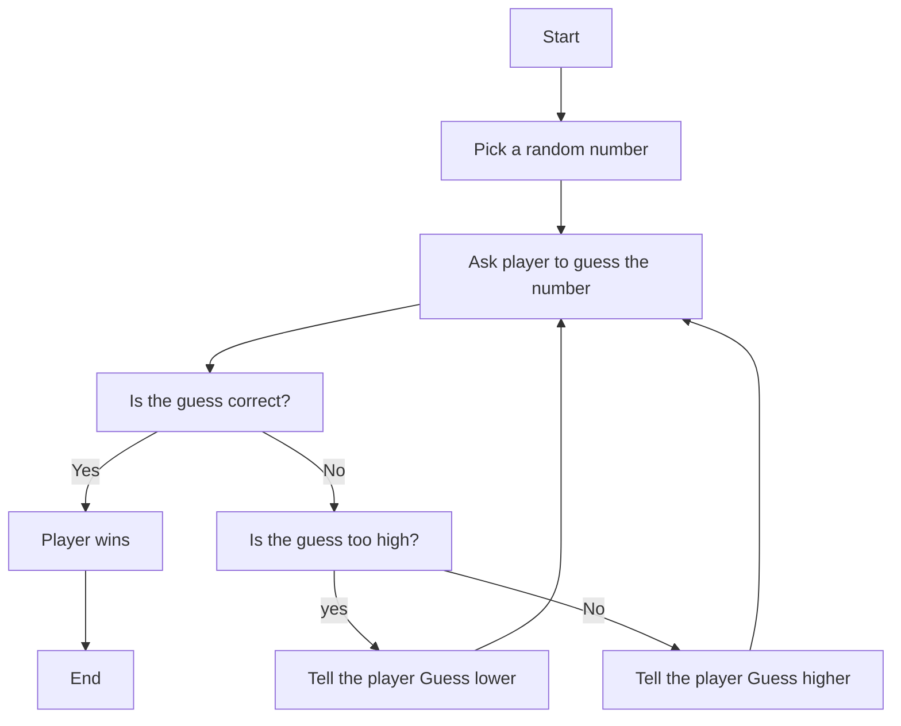

Description for number guessing game.
first the computer generates a random number.
Step two the computer asks the user to guess a number.
If the user guess correct, the user wins and the game ends.
If the user guesses incorrect the computer will check if the guess is too high or too low.
If the guess is too high then it will tell the user to guess lower, if the guess is too low then the computer to tell the user to guess higher.
The computer to loop back for the user to guess again and once the user is correct the user wins and the game ends.