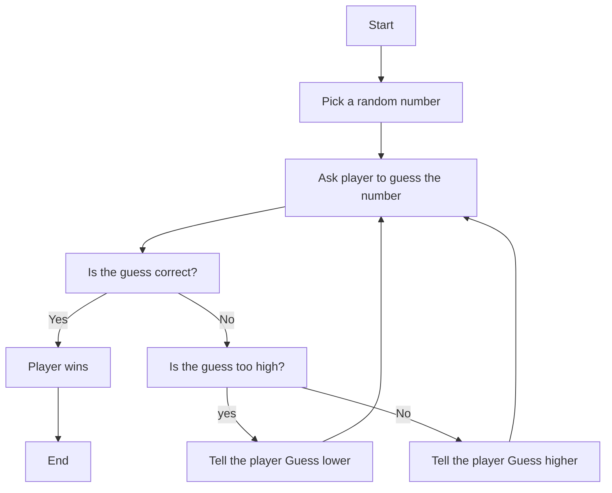

```mermaid
flowchart TD
    A[Start] --> B[Pick a random number]
    B --> C[Ask player to guess the number]
    C --> D[Is the guess correct?]
    D -->|Yes| E[Player wins]
    D -->|No| F[Is the guess too high?]
    F -->|yes| G[Tell the player Guess lower]
    F -->|No| H[Tell the player Guess higher]
    G --> C
    H --> C
    E --> I[End]
```